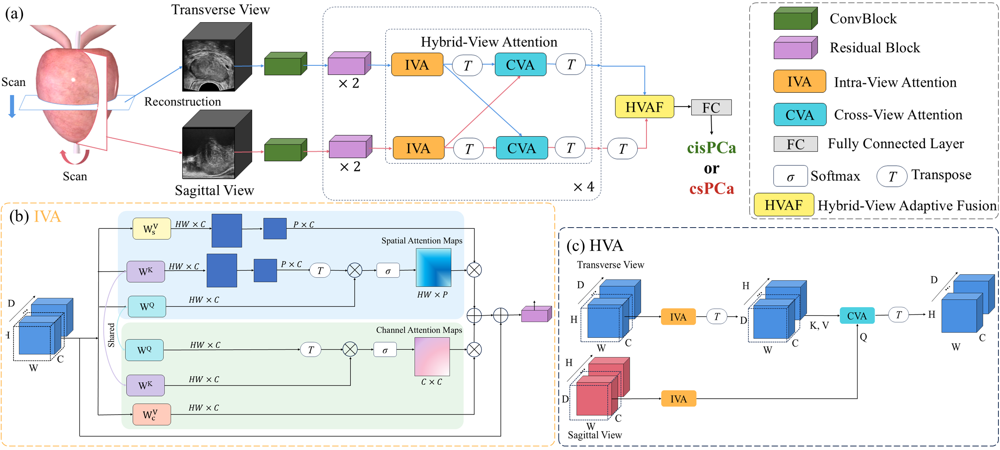
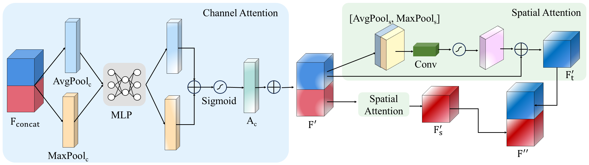
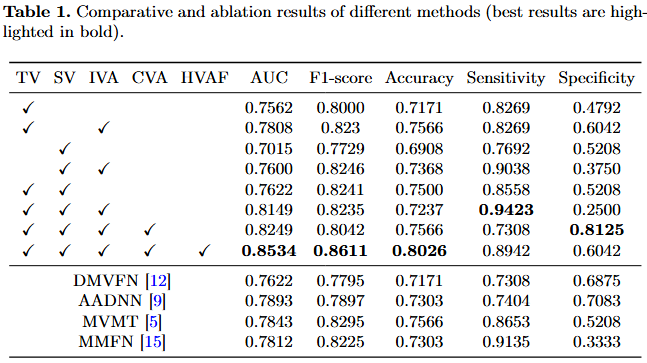

# Hybrid-View Attention Network (HVAN)

This repository contains the official implementation of the paper:

**"Hybrid-View Attention Network for Clinically Significant Prostate Cancer Classification in Transrectal Ultrasound"**  
Accepted at *MICCAI 2025* [[MICCAI2025]]

---

## 🧠 Method Overview

### Overall Framework



The proposed HVAN framework introduces a hybrid-view learning strategy for transrectal ultrasound (TRUS) images. It consists of:

- **CNN-Transformer Hybrid Backbone:** Combines convolutional layers for local feature extraction with a transformer-based Hybrid-View Attention (HVA) module for modeling long-range dependencies. See panel (a).
- **Hybrid-View Attention (HVA):** Enhances representations through both intra-view attention (refining features within a view) and cross-view attention (capturing complementary information across views), as illustrated in panels (b) and (c).
- **Hybrid-View Adaptive Fusion (HVAF):** Dynamically integrates multi-scale features along spatial and channel dimensions for improved classification accuracy.

---

### Hybrid-View Adaptive Fusion (HVAF)



---

## 📊 Results



Comparative and ablation results prove the efficacy of our method.

---

## 🚀 Training

To train the network, simply run:

```bash
python train.py
